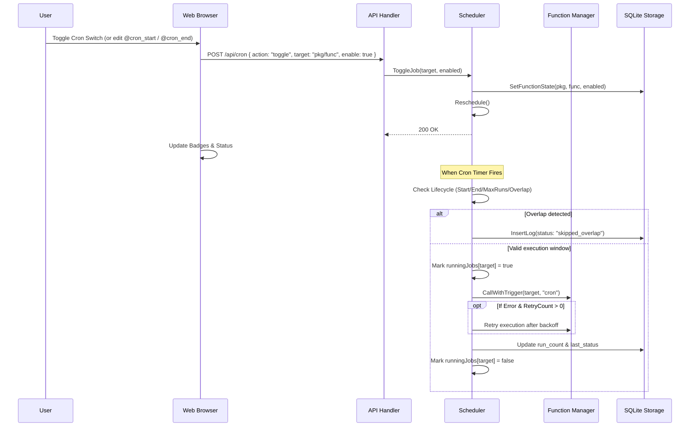

# Comprehensive Cron Management (Package B) Design Specification

**Date:** 2026-09-30  
**Status:** Draft / Ready for Review  
**Target:** ActaCron Cron Engine, Parser, Storage, API, and Web UI  

---

## 1. Context & Motivation

In ActaCron, scripts can define a scheduled trigger using the JSDoc `@cron` annotation (e.g. `* @cron */5 * * * *`). While backend support for pausing functions (`IsEnabled`) exists in the database and scheduler, the system currently lacks:
1. **Direct UI Controls**: No toggle switch to pause/resume cron jobs from the Script Inspector or Overview table.
2. **Lifecycle Bounds**: No mechanism to specify a start time (`@cron_start`) or an expiration time (`@cron_end`).
3. **Execution Safety**: If an execution takes longer than the cron interval, overlapping runs can cause race conditions or resource exhaustion.
4. **Timezone Awareness**: Cron schedules currently evaluate against the host server timezone with no explicit timezone configuration (`@timezone`).
5. **Fault Tolerance & Batch Limits**: No automatic retry policy (`@retry`) or maximum execution count limit (`@max_runs`).
6. **Observability**: Next Run countdown, Prev Run execution status, and lifecycle status badges (`Active`, `Paused`, `Pending`, `Expired`, `Running`) are missing from the UI.

This specification defines **Package B (Comprehensive Cron Management)** to elevate ActaCron into a production-grade scheduled workflow platform.

---

## 2. Core Features & Requirements

### 2.1 JSDoc Annotations & Source of Truth
Scripts remain the single source of truth for their scheduling parameters (GitOps model):
* `@cron <expression>`: Standard 5-field cron expression (e.g. `*/5 * * * *`).
* `@cron_start <ISO-8601 | YYYY-MM-DD HH:mm:ss>`: Earliest timestamp when the schedule may begin executing.
* `@cron_end <ISO-8601 | YYYY-MM-DD HH:mm:ss>`: Expiration timestamp after which the schedule ceases executing.
* `@timezone <IANA-tz>`: IANA Timezone string (e.g. `Asia/Ho_Chi_Minh`, `UTC`, `America/New_York`). Defaults to system local time if omitted.
* `@retry <count> [delay]`: Number of retries on failure (e.g. `@retry 3 5s` = 3 retries with 5s backoff).
* `@max_runs <N>`: Maximum successful runs before auto-pausing (0 = unlimited).
* `@no_overlap <true|false>`: Whether to skip execution if a previous instance is still running (default: `true`).

### 2.2 Database & Persistence Layer (`internal/storage`)
The SQLite table `function_state` stores runtime state and overrides:
* `is_enabled` (INTEGER, 1 or 0): Manual pause/resume flag.
* `run_count` (INTEGER): Cumulative successful run count since reset.
* `last_status` (TEXT): Status of most recent run (`success`, `error`, `skipped_overlap`).
* `last_run_at` (TIMESTAMP): Time of most recent run.
* `cron_start` (TEXT, nullable): Cached start time.
* `cron_end` (TEXT, nullable): Cached end time.
* `timezone` (TEXT, nullable): Cached timezone.
* `max_runs` (INTEGER, default 0): Cached max runs.

### 2.3 Scheduler Engine (`internal/scheduler`)
* **Timezone Integration**: Wrap cron parser with `cron.WithLocation(loc)` using `time.LoadLocation(fn.Timezone)`.
* **Lifecycle Validation on Trigger**:
  1. If `!fn.IsEnabled`: Skip.
  2. If `fn.CronStart != ""` and `now < parseTime(fn.CronStart)`: Mark as `Pending`, skip.
  3. If `fn.CronEnd != ""` and `now > parseTime(fn.CronEnd)`: Mark as `Expired`, disable job (`IsEnabled = false`), skip.
  4. If `fn.MaxRuns > 0 && fn.RunCount >= fn.MaxRuns`: Mark as `Completed`, disable job (`IsEnabled = false`), skip.
* **Overlap Guard (Concurrency Control)**:
  - Maintain a thread-safe map `runningJobs[package/function] = true`.
  - When a job triggers, if `fn.NoOverlap != false` and `runningJobs[targetKey] == true`:
    - Log warning: `[Scheduler] Overlap detected for <pkg>/<func>. Previous execution still active. Skipping run.`
    - Insert a log entry with status `skipped_overlap`.
    - Skip execution.
  - Upon finish, remove from `runningJobs`.
* **Retry Execution**:
  - If a function returns an error and `fn.RetryCount > 0`:
    - Sleep for `RetryDelay` (default 5s) and re-execute, up to `RetryCount` attempts.
    - Log retry attempts in console logs.

### 2.4 API Layer (`internal/api`)
* `GET /api/cron`: Returns `[]CronJobInfo` enriched with:
  - `status`: Computed lifecycle state (`active`, `paused`, `pending`, `expired`, `running`).
  - `is_enabled`: Boolean manual toggle state.
  - `next_run`: Formatted timestamp.
  - `prev_run`: Formatted timestamp.
  - `run_count`: Integer.
  - `max_runs`: Integer.
  - `cron_start`: String.
  - `cron_end`: String.
  - `timezone`: String.
  - `is_running`: Boolean.
* `POST /api/cron`:
  - `{ "action": "toggle", "target": "pkg/func", "enable": true|false }`
  - `{ "action": "reset_runs", "target": "pkg/func" }`
  - `{ "action": "run", "target": "pkg/func" }`

### 2.5 Web UI (`web/`)
1. **Script Inspector (Right Pane)**:
   - **Cron Toggle Switch**: `Enable Cron Schedule` checkbox toggle.
   - **Cron Schedule Input**: Expression with human-readable explanation below.
   - **Timezone Input**: Select / text input (e.g. `System Local`, `Asia/Ho_Chi_Minh`, `UTC`).
   - **Advanced Scheduling Accordion / Collapsible**:
     - `Start Datetime`: `<input type="datetime-local" id="inspCronStart">`
     - `End Datetime`: `<input type="datetime-local" id="inspCronEnd">`
     - `Max Runs`: `<input type="number" min="0" id="inspMaxRuns">`
     - `Retry on Failure`: `<input type="number" min="0" id="inspRetryCount">`
     - `Prevent Overlap`: `<input type="checkbox" id="inspNoOverlap" checked>`
   - Modifying any value updates the editor's JSDoc comments automatically and vice versa.
2. **Overview Dashboard**:
   - `Active Scheduled Crons` table:
     - Columns: `Function`, `Schedule & TZ`, `Lifecycle Status`, `Next Run`, `Actions` (Run Now + Toggle Switch).
     - Status badges:
       - 🟢 `ACTIVE` (Scheduled)
       - 🟡 `PENDING` (Waiting for start datetime)
       - ⚪ `PAUSED` (Disabled via switch)
       - 🔴 `EXPIRED` (Past end datetime)
       - 🔵 `RUNNING` (Currently executing)
3. **Tree Pane (Left)**:
   - Mini badges update dynamically based on status: `CRON` (green), `PAUSED` (muted gray), `EXPIRED` (red), `PENDING` (blue).
4. **i18n**: Full bilingual support (English and Vietnamese) for all labels, placeholders, and status text.

---

## 3. Data Flow & Sequence Diagram

---

## 4. Error Handling & Edge Cases

1. **Invalid Timezone String**: If `time.LoadLocation(tz)` fails, log a warning and fallback gracefully to `time.Local`. Do not crash the scheduler.
2. **Malformed Date Formats**: Support standard ISO 8601 (`2026-10-01T08:00:00Z`), HTML datetime-local format (`2026-10-01T08:00`), and space format (`2026-10-01 08:00:00`). If parsing fails, ignore the constraint and log a parse warning.
3. **Clock Skew / Leap Seconds**: Time calculations use UTC standard normalization.
4. **Rapid Toggle Flapping**: Reschedule calls are mutex-locked in `Scheduler` to prevent race conditions during rapid user toggles.
5. **Database Disconnection**: If SQLite is temporarily busy, memory state in `Manager` and `Scheduler` remains operational.

---

## 5. Verification & Testing Strategy

1. **Parser Tests (`internal/parser/parser_test.go`)**:
   - Verify parsing of `@cron_start`, `@cron_end`, `@timezone`, `@retry`, `@max_runs`, `@no_overlap`.
2. **Storage Tests (`internal/storage/storage_test.go`)**:
   - Verify persistence of `run_count`, `cron_start`, `cron_end`, `is_enabled`.
3. **Scheduler Tests (`internal/scheduler/scheduler_test.go`)**:
   - Test overlap guard (concurrent execution skipped).
   - Test `Pending` status before `CronStart`.
   - Test `Expired` status after `CronEnd`.
   - Test `Completed` status when `run_count >= max_runs`.
   - Test retry backoff on failure.
4. **Embed & Web UI Tests (`web/embed_test.go`)**:
   - Verify new DOM elements exist in `index.html`.
   - Verify i18n keys in `i18n.js`.
   - Verify app.js event wiring for toggles and advanced scheduling inputs.
